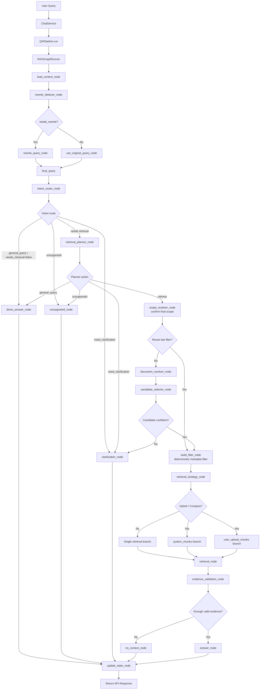
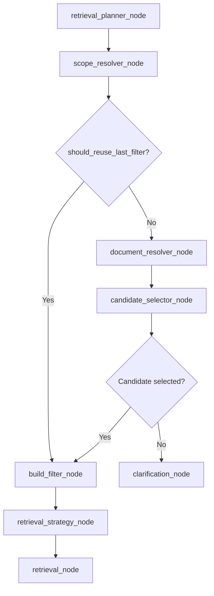

# RAG Pipeline Hiện Tại

Pipeline hiện tại đã được refactor sang LangGraph. `QAPipeline.run()` vẫn là facade để API cũ không bị thay đổi, nhưng bên trong gọi `RAGGraphRunner`.

## Sơ Đồ Tổng Thể



## Luồng Chi Tiết

```text
User Query
→ ChatService
→ QAPipeline.run
→ RAGGraphRunner
→ load_context_node
→ rewrite_detector_node
→ rewrite_query_node nếu needs_rewrite=true
→ use_original_query_node nếu needs_rewrite=false
→ intent_router_node
→ retrieval_planner_node nếu query cần retrieval
→ scope_resolver_node
→ document_resolver_node
→ candidate_selector_node
→ build_filter_node
→ retrieval_strategy_node
→ retrieval_node
→ evidence_validation_node
→ answer_node / no_context_node / direct_answer_node / clarification_node / unsupported_node
→ update_state_node
→ return response
```

## RAGState / Graph Runtime State

Graph dùng `RAGState`, không gọi là Runtime Context trong phần LangGraph.

State chính gồm:

```json
{
  "user_id": "...",
  "session_id": "...",
  "requested_scope": "auto",
  "selected_document_ids": [],
  "runtime_context": {},

  "original_query": "...",
  "final_query": "...",
  "rewritten_query": null,
  "was_rewritten": false,
  "rewrite_gate": {},
  "query_rewrite": {},

  "intent_resolution": {},
  "scope_resolution": {},
  "document_resolution": {},
  "retrieval_plan": {},

  "planner_action": "...",
  "planner_reason": "...",
  "document_candidates": [],
  "candidate_selection": {},
  "metadata_filter": {},

  "branch_results": [],
  "raw_contexts": [],
  "context_validation": {},
  "mixed_branch_warnings": [],

  "answer": "...",
  "sources": []
}
```

## Các Node Chính

### 1. `load_context_node`

Nạp runtime context vào graph:

- `current_user_id`
- `current_session_id`
- `active_document_ids`
- `current_session_docs`
- `recent_chat_history`
- `last_resolved_context`

Không nạp full chunk text vào state.

### 2. `rewrite_detector_node`

Dùng `RewriteGate` để quyết định query có cần rewrite không.

Input:

- `original_query`
- `recent_chat_history`
- `last_filename`
- `last_procedure_title`
- `last_referenced_doc`

Output:

```json
{
  "needs_rewrite": true,
  "reason": "...",
  "matched_rules": [],
  "used_llm": true
}
```

### 3. `rewrite_query_node`

Chỉ chạy khi `needs_rewrite=true`.

Dùng `QueryRewriter.rewrite_standalone()` để biến câu follow-up/mơ hồ thành standalone query.

Ví dụ:

```text
Original query:
Đi đăng ký cần chuẩn bị gì?

Rewritten query:
Thủ tục đăng ký kết hôn cần chuẩn bị những giấy tờ gì?
```

### 4. `intent_router_node`

Xác định user muốn làm gì, không xác định scope.

Intent hiện có:

- `ask_question`
- `summarize_document`
- `compare_documents`
- `find_information`
- `general_query`
- `need_clarification`
- `unsupported`

Nếu `general_query` hoặc `needs_retrieval=false` thì đi thẳng `direct_answer_node`.

### 5. `retrieval_planner_node`

Quyết định action retrieval trước khi resolve document.

Action hiện có:

- `reuse_last_filter`
- `resolve_system_procedure`
- `resolve_current_upload`
- `resolve_previous_upload`
- `resolve_user_file_name`
- `semantic_document_search`
- `mixed_retrieval`
- `need_clarification`
- `general_query`
- `unsupported`

Rule quan trọng:

- Ưu tiên `reuse_last_filter` cho follow-up nếu đủ an toàn.
- Nếu có dấu hiệu đổi nguồn/chủ đề thì không reuse filter cũ.

Chỉ reuse khi:

- Có `last_resolved_context.filter`.
- Query đã rewrite hoặc có dấu hiệu follow-up.
- Không có source-switch signal như: `file upload`, `file vừa upload`, `hôm qua`, `hôm kia`, `lần trước`, `so sánh`, `đối chiếu`, tên file mới, tên thủ tục mới.

### 6. `scope_resolver_node`

Xác định scope thật bằng cách kết hợp:

- `retrieval_plan.action` từ planner.
- `RAGState`.
- `last_resolved_context`.
- `recent_chat_history`.
- `current_session_docs`.
- `selected_document_ids`.
- LLM structured output khi được cấu hình.
- Fallback deterministic khi LLM lỗi hoặc bị tắt.

Node này không build metadata filter cuối cùng.

LLM trong node này chỉ được trả structured JSON, không được tự tạo filter và không được quyết định quyền truy cập.

Schema output chính:

```json
{
  "scope": "system_procedure",
  "resolution_mode": "reuse_last_context",
  "should_reuse_last_filter": true,
  "source_type": "system",
  "procedure_title_hint": "Đăng ký kết hôn",
  "document_name_hint": null,
  "document_id_hint": null,
  "time_hint": null,
  "document_topic_hint": null,
  "branches": [],
  "needs_clarification": false,
  "clarification_question": null,
  "confidence": 0.9,
  "reason": "Safe follow-up reused last resolved context."
}
```

Scope chính:

- `system_docs`
- `system_procedure`
- `current_session_uploads`
- `user_all_uploads`
- `user_file_name`
- `hybrid_system_and_user`
- `general_query`
- `need_clarification`

Resolution mode chính:

- `reuse_last_context`
- `switch_scope`
- `resolve_new_procedure`
- `resolve_current_upload`
- `resolve_previous_upload`
- `resolve_by_filename`
- `resolve_by_time_hint`
- `semantic_document_search`
- `mixed`
- `need_clarification`

Guard quan trọng:

- Nếu `retrieval_plan.action = reuse_last_filter`, node vẫn kiểm tra lại `last_resolved_context.filter`.
- Nếu query có dấu hiệu đổi nguồn như `file vừa upload`, `hôm qua`, `lần trước`, `so sánh`, `đối chiếu`, tên file mới, thì chặn reuse.
- Nếu query đã rewrite và vẫn cùng procedure/file cũ, node ưu tiên reuse context.
- Nếu không chắc, node trả `needs_clarification=true`.

### 7. `document_resolver_node`

Resolve document/procedure cụ thể bằng database metadata.

Không retrieve chunk ở bước này.

Xử lý:

- System procedure theo `procedure_title`.
- File user theo `filename`.
- File trong session theo `owner_user_id + session_id`.
- File cũ theo `owner_user_id`, metadata thời gian, hoặc `last_referenced_doc`.

### 8. `candidate_selector_node`

Xử lý khi có nhiều tài liệu phù hợp.

Rule:

- 0 hoặc 1 candidate: cho đi tiếp.
- Nhiều candidate: chưa tự chọn, đi `clarification_node`.
- Nếu sau này dùng LLM selector thì chỉ đưa top 3-5 candidates, không đưa chunk text.

### 9. `build_filter_node`

Build metadata filter cuối cùng bằng code.

Đây là node duy nhất chịu trách nhiệm tạo filter retrieve cho Chroma.

Input chính:

- `scope_resolution.scope`
- `scope_resolution.procedure_title_hint`
- `scope_resolution.document_name_hint`
- `document_resolution.selected_document_ids`
- `user_id`
- `session_id`

Nếu `scope_resolution.should_reuse_last_filter=true`, node dùng lại `last_resolved_context.filter`.

Ví dụ filter:

```json
{
  "source_type": "user_upload",
  "owner_user_id": "user_1",
  "session_id": "sess_1",
  "document_id": {
    "$in": ["doc_1"]
  }
}
```

Không cho LLM tự build filter.

### 10. `retrieval_strategy_node`

Chọn cách retrieve:

- `default`: top-k thường.
- `summarize`: top-k lớn hơn.
- `find_information`: top-k trung bình.
- `hybrid_compare`: tách nhánh system/user upload.

### 11. `retrieval_node`

Embed `final_query` và search Chroma theo metadata filter.

Không search toàn bộ vector DB nếu chưa có filter hợp lệ.

Hybrid retrieval tách rõ:

- `system_chunks`
- `user_upload_chunks`

### 12. `evidence_validation_node`

Validate evidence:

- Loại chunk sai metadata.
- Loại chunk score thấp.
- Nếu không có chunk hợp lệ thì fallback.
- Với mixed retrieval, validate từng nhánh riêng.

Mixed warning:

```text
Chưa tìm thấy thông tin tương ứng trong tài liệu hệ thống.
Chưa tìm thấy thông tin tương ứng trong tài liệu bạn upload.
```

### 13. `answer_node`

Chỉ chạy khi có context/evidence hợp lệ.

LLM phải trả lời dựa trên context, không tự suy diễn.

Sau đó `SourceFormatter` gắn nguồn:

- Theo tài liệu hệ thống...
- Theo tài liệu bạn upload...

### 14. `direct_answer_node`

Dùng cho câu không cần retrieval, ví dụ:

- Chào bạn
- Bạn là gì?
- Bạn giúp được gì?

Không gọi retriever.

### 15. `clarification_node`

Dùng khi thiếu scope/document hoặc có nhiều candidate.

Ví dụ:

```text
Mình cần bạn làm rõ tài liệu muốn hỏi: file vừa upload, file cũ, tài liệu hệ thống, hoặc một file cụ thể.
```

### 16. `unsupported_node`

Dùng cho yêu cầu ngoài phạm vi RAG tài liệu.

Ví dụ:

- Vẽ ảnh
- Viết code
- Đặt vé
- Mua hàng

### 17. `update_state_node`

Hiện node này là điểm kết thúc graph.

State được lưu thực tế ở `ChatService` qua `ConversationStateManager.update_after_answer()`.

Sau mỗi answer, lưu:

- `last_intent`
- `last_scope`
- `last_sources`
- `last_document_ids`
- `last_rewritten_question`
- `last_procedure_title`
- `last_filename`
- `last_referenced_doc`
- `last_resolved_context.filter`

## Security Rules

- Không tin `document_id` do user tự nhập nếu chưa kiểm tra quyền.
- User hỏi file upload phải luôn có `owner_user_id`.
- User hỏi file trong session phải có `owner_user_id + session_id`.
- User hỏi system procedure phải có `source_type=system + procedure_title`.
- Hybrid retrieval dùng hai nhánh filter riêng.
- Không search toàn bộ Chroma nếu chưa rõ scope/filter.

## Output API Vẫn Giữ Nguyên

`QAPipeline.run()` vẫn trả:

```json
{
  "answer": "...",
  "sources": [],
  "raw_contexts": [],
  "scope": "...",
  "intent_resolution": {},
  "scope_resolution": {},
  "document_resolution": {},
  "rewrite_gate": {},
  "query_rewrite": {},
  "retrieval_plan": {},
  "context_validation": {},
  "retrieval_filter": {}
}
```

Nhờ vậy API chat hiện tại không bị vỡ.

---

## Thiết Kế Chi Tiết Các Node Điều Phối Quan Trọng

Phần này mô tả kỹ hơn các node điều phối chính trong LangGraph. Nguyên tắc chung:

- Mỗi node đọc `RAGState` và trả partial update vào state.
- Conditional edge quyết định node tiếp theo dựa trên state mới.
- Không biến pipeline thành LLM agent tự do.
- LLM chỉ dùng để hiểu ngôn ngữ tự nhiên hoặc chọn khi mơ hồ.
- Rule/code/database/metadata vẫn là lớp kiểm soát tốc độ, bảo mật và debug.
- Metadata filter cuối cùng chỉ được build deterministic ở `build_filter_node`.

### 1. `rewrite_detector_node`

Mục tiêu:

- Quyết định query có cần rewrite không.
- Không rewrite mọi query.
- Không phân intent.
- Không phân scope.
- Không retrieve.

Input từ `RAGState`:

```json
{
  "original_query": "...",
  "runtime_context": {
    "recent_chat_history": [],
    "last_resolved_context": {},
    "last_procedure_title": null,
    "last_filename": null,
    "last_referenced_doc": {}
  }
}
```

Cần rewrite khi query phụ thuộc lịch sử hoặc có tham chiếu mơ hồ:

- `thủ tục này`
- `file đó`
- `cái này`
- `giá đăng ký thì sao`
- `đi đăng ký cần chuẩn bị gì`
- `thời hạn bao lâu`
- `còn cái kia thì sao`

Không cần rewrite khi query đã đủ rõ:

- `Thủ tục đăng ký kết hôn cần giấy tờ gì?`
- `Thông tin người dùng trong file tôi upload hôm qua là gì?`
- `File vừa upload có những thông tin nào?`
- `So sánh file tôi vừa upload với quy định hệ thống`

Output partial update:

```json
{
  "rewrite_gate": {
    "needs_rewrite": true,
    "reason": "Query is a follow-up that depends on recent chat history.",
    "matched_rules": ["follow_up", "has_history"],
    "used_llm": true
  }
}
```

Fallback:

- Nếu LLM lỗi hoặc không cấu hình, trả `needs_rewrite=false`.
- Không tự đoán rewrite để tránh làm sai query gốc.

Conditional edge:

```text
rewrite_gate.needs_rewrite=true  → rewrite_query_node
rewrite_gate.needs_rewrite=false → use_original_query_node
```

### 2. `retrieval_planner_node`

Mục tiêu:

- Quyết định retrieval action sơ bộ.
- Không retrieve chunk.
- Không build metadata filter.
- Không resolve document cụ thể.
- Không quyết định quyền truy cập.

Input từ `RAGState`:

```json
{
  "final_query": "...",
  "original_query": "...",
  "rewritten_query": "...",
  "was_rewritten": true,
  "intent_resolution": {},
  "runtime_context": {
    "last_resolved_context": {},
    "current_session_docs": []
  },
  "selected_document_ids": [],
  "requested_scope": "auto"
}
```

Output action hợp lệ:

- `reuse_last_filter`
- `resolve_system_procedure`
- `resolve_current_upload`
- `resolve_previous_upload`
- `resolve_user_file_name`
- `semantic_document_search`
- `mixed_retrieval`
- `need_clarification`
- `general_query`
- `unsupported`

Output partial update:

```json
{
  "planner_action": "reuse_last_filter",
  "planner_reason": "Safe follow-up with last resolved context.",
  "retrieval_plan": {
    "action": "reuse_last_filter",
    "target_scope": "system_procedure",
    "reason": "Safe follow-up with last resolved context."
  }
}
```

Planning rules:

- Nếu `intent.needs_retrieval=false`, trả `general_query` hoặc `unsupported`.
- Nếu query là follow-up cùng ngữ cảnh và có `last_resolved_context.filter`, ưu tiên `reuse_last_filter`.
- Không reuse nếu query có source-switch signal.
- Nếu hỏi thủ tục hành chính mới, trả `resolve_system_procedure`.
- Nếu hỏi file upload hiện tại, trả `resolve_current_upload`.
- Nếu hỏi file upload cũ theo thời gian, trả `resolve_previous_upload`.
- Nếu hỏi file upload cũ theo chủ đề, trả `semantic_document_search`.
- Nếu hỏi so sánh system với upload, trả `mixed_retrieval`.

Source-switch signal:

- `file vừa upload`
- `file vừa gửi`
- `tài liệu vừa gửi`
- `file tôi upload hôm qua`
- `hôm kia`
- `ngày 15/7`
- `lần trước`
- `tài liệu cũ`
- `tài liệu tôi từng upload`
- `so sánh`
- `đối chiếu`
- `với quy định hệ thống`
- tên file mới
- tên thủ tục mới khác `last_resolved_context.procedure_title`

Ví dụ follow-up reuse:

```text
Turn 1:
User: Giấy đăng ký kết hôn đăng ký tại đâu?
→ last_resolved_context.scope = system_procedure
→ last_resolved_context.filter = {source_type: system, procedure_title: Đăng ký kết hôn}

Turn 2:
User: Đi đăng ký cần chuẩn bị gì?
→ rewritten_query = Thủ tục đăng ký kết hôn cần chuẩn bị giấy tờ gì?
→ planner_action = reuse_last_filter
```

### 3. `scope_resolver_node`

Mục tiêu:

- Là node trung gian thông minh giữa `retrieval_planner_node` và `document_resolver_node`.
- Nhận `retrieval_plan.action` nhưng không tin tuyệt đối.
- Dùng `RAGState` để xác định scope thật.
- Dùng LLM structured output khi cần hiểu câu mơ hồ.
- Không build metadata filter cuối cùng.
- Không tự chọn quyền truy cập tài liệu.

Input từ `RAGState`:

```json
{
  "final_query": "...",
  "original_query": "...",
  "rewritten_query": "...",
  "was_rewritten": true,
  "intent_resolution": {},
  "retrieval_plan": {},
  "planner_action": "...",
  "runtime_context": {
    "recent_chat_history": [],
    "last_resolved_context": {},
    "current_session_docs": [],
    "active_document_ids": []
  },
  "selected_document_ids": [],
  "document_candidates": [],
  "requested_scope": "auto"
}
```

Scope hợp lệ:

- `system_docs`
- `system_procedure`
- `current_session_uploads`
- `user_all_uploads`
- `user_file_name`
- `hybrid_system_and_user`
- `general_query`
- `need_clarification`

Resolution mode hợp lệ:

- `reuse_last_context`
- `switch_scope`
- `resolve_new_procedure`
- `resolve_current_upload`
- `resolve_previous_upload`
- `resolve_by_filename`
- `resolve_by_time_hint`
- `semantic_document_search`
- `mixed`
- `need_clarification`

Output bắt buộc:

```json
{
  "scope_resolution": {
    "scope": "system_procedure",
    "resolution_mode": "reuse_last_context",
    "should_reuse_last_filter": true,
    "source_type": "system",
    "procedure_title_hint": "Đăng ký kết hôn",
    "document_name_hint": null,
    "document_id_hint": null,
    "time_hint": null,
    "document_topic_hint": null,
    "branches": [],
    "needs_clarification": false,
    "clarification_question": null,
    "confidence": 0.95,
    "reason": "The rewritten query continues the previously resolved procedure."
  }
}
```

Behavior quan trọng:

- Nếu planner đề xuất `reuse_last_filter`, node vẫn kiểm tra lại `last_resolved_context.filter`.
- Nếu query có dấu hiệu đổi nguồn/chủ đề, node override planner action.
- Nếu query đã rewrite và rewritten query vẫn cùng procedure/file cũ, ưu tiên reuse.
- Nếu user hỏi upload cũ theo thời gian, trả `time_hint`.
- Nếu user hỏi upload cũ theo chủ đề, trả `document_topic_hint`.
- Nếu mixed, trả `branches`, không gộp filter.
- Nếu không chắc, trả `needs_clarification=true`.

Ví dụ follow-up cùng procedure:

```json
{
  "scope": "system_procedure",
  "resolution_mode": "reuse_last_context",
  "should_reuse_last_filter": true,
  "source_type": "system",
  "procedure_title_hint": "Đăng ký kết hôn",
  "needs_clarification": false,
  "confidence": 0.95,
  "reason": "The rewritten query continues the previously resolved procedure."
}
```

Ví dụ đổi sang file upload hiện tại:

```json
{
  "scope": "current_session_uploads",
  "resolution_mode": "switch_scope",
  "should_reuse_last_filter": false,
  "source_type": "user_upload",
  "needs_clarification": false,
  "confidence": 0.9,
  "reason": "User explicitly refers to the recently uploaded file."
}
```

Ví dụ upload cũ theo thời gian:

```json
{
  "scope": "user_all_uploads",
  "resolution_mode": "resolve_by_time_hint",
  "should_reuse_last_filter": false,
  "source_type": "user_upload",
  "time_hint": "yesterday",
  "needs_clarification": false,
  "confidence": 0.9,
  "reason": "User refers to an uploaded document from yesterday."
}
```

Ví dụ mixed:

```json
{
  "scope": "hybrid_system_and_user",
  "resolution_mode": "mixed",
  "should_reuse_last_filter": false,
  "source_type": "hybrid",
  "branches": [
    {
      "branch_name": "system",
      "scope": "system_docs",
      "procedure_title_hint": null
    },
    {
      "branch_name": "user_upload",
      "scope": "current_session_uploads"
    }
  ],
  "needs_clarification": false,
  "confidence": 0.9,
  "reason": "User asks to compare uploaded file with system regulations."
}
```

Security boundary:

- LLM không được trả `metadata_filter`.
- LLM không được tự chọn `owner_user_id`, `session_id`.
- LLM không được tự quyết quyền truy cập tài liệu.
- Filter cuối cùng phải đi qua `build_filter_node`.

Conditional edge:

```text
scope_resolution.needs_clarification=true → clarification_node
scope=general_query                         → direct_answer_node
else                                        → document_resolver_node
```

### 4. `document_resolver_node`

Mục tiêu:

- Resolve document/procedure cụ thể bằng database metadata/catalog.
- Không retrieve chunk.
- Không build filter cuối.
- Không dùng LLM để tự tạo filter.

Input:

```json
{
  "scope_resolution": {},
  "user_id": "...",
  "session_id": "...",
  "runtime_context": {
    "current_session_docs": []
  },
  "selected_document_ids": [],
  "requested_scope": "auto"
}
```

Output:

```json
{
  "document_resolution": {
    "selected_document_ids": [],
    "resolved_documents": [],
    "needs_clarification": false,
    "reason": "matched current session uploads"
  },
  "document_candidates": []
}
```

Xử lý theo scope:

`system_procedure`:

- Dùng `procedure_title_hint`.
- Exact match `procedure_title` thì chọn.
- Nếu fuzzy/semantic match nhiều procedure thì trả candidates.
- Nếu không có hint nhưng query có chủ đề hành chính, search trên `procedure_title/title`.
- Không ưu tiên filename cho tài liệu hệ thống.

`current_session_uploads`:

- Query documents theo `source_type=user_upload`, `owner_user_id=current_user_id`, `session_id=current_session_id`.
- Nếu UI có `selected_document_ids`, ưu tiên selected docs sau khi check quyền.
- Nếu session chỉ có 1 file, chọn luôn.
- Nếu nhiều file mà query không rõ, chuyển candidate selector/clarification.

`user_all_uploads`:

- Query theo `source_type=user_upload`, `owner_user_id=current_user_id`.
- Nếu có `time_hint`, resolve theo thời gian.
- Thứ tự fallback thời gian: `uploaded_at` → `created_at` → `file_storage_created_at` → `chat_message_upload_time`.
- Nếu có `document_topic_hint`, search trên `filename/title/metadata`.
- Nếu nhiều candidate, chuyển `candidate_selector_node`.
- Nếu thiếu dữ kiện, chuyển clarification.

`user_file_name`:

- Query theo `filename/document_name`.
- Luôn kèm `owner_user_id`.

`hybrid_system_and_user`:

- Resolve từng branch riêng.
- Không gộp candidates từ system và user ngay từ đầu.

### 5. `candidate_selector_node`

Mục tiêu:

- Xử lý khi `document_resolver_node` trả nhiều candidate.
- Không đưa full chunk text vào LLM.
- Chỉ đưa metadata ngắn của top 3-5 documents nếu cần LLM selector.
- Nếu không chắc, hỏi user chọn.

Input:

```json
{
  "final_query": "...",
  "scope_resolution": {},
  "document_candidates": []
}
```

Output:

```json
{
  "candidate_selection": {
    "selected_document_ids": [],
    "selected_documents": [],
    "confidence": 0.0,
    "confident": false,
    "needs_clarification": true,
    "clarification_question": "Bạn muốn hỏi tài liệu nào: A.pdf, B.pdf hay C.pdf?",
    "reason": "Multiple candidate documents need user clarification."
  }
}
```

Logic:

- 0 candidate: `not_found` hoặc clarification.
- 1 candidate: chọn luôn.
- Nhiều candidate + exact filename/date/procedure match: chọn candidate đó.
- Nhiều candidate + top confidence cao: có thể chọn.
- Nhiều candidate mơ hồ: hỏi user.
- Nếu dùng LLM selector, chỉ đưa top 3-5 metadata, không đưa chunk text.

Threshold:

- Nếu confidence `< 0.75`, chuyển `clarification_node`.

Conditional edge:

```text
candidate_selection.needs_clarification=true → clarification_node
else                                         → build_filter_node
```

### 6. `evidence_validation_node`

Mục tiêu:

- Chặn hallucination.
- Chỉ cho `answer_node` chạy khi evidence hợp lệ.
- Validate cả metadata và semantic sufficiency.

Input:

```json
{
  "final_query": "...",
  "metadata_filter": {},
  "raw_contexts": [],
  "branch_results": [],
  "retrieval_plan": {},
  "scope_resolution": {}
}
```

Output:

```json
{
  "context_validation": {
    "should_answer": true,
    "valid_contexts": [],
    "invalid_contexts": [],
    "missing_branches": [],
    "warnings": [],
    "reason": "Valid evidence found."
  },
  "raw_contexts": [],
  "mixed_branch_warnings": []
}
```

Hard validation bằng code:

- Có chunk hay không.
- Chunk có đúng `metadata_filter` không.
- Chunk có đúng `source_type` không.
- Chunk có đúng `document_id/procedure_title` không.
- Score có đạt threshold không.
- Với mixed retrieval, từng branch có evidence không.

Soft validation:

- Context có khả năng trả lời câu hỏi hay không.
- Có thể để prompt answer xử lý bằng rule: nếu context không chứa câu trả lời thì nói không tìm thấy.
- Có thể thêm LLM validator nhỏ sau này, nhưng không bắt buộc ở giai đoạn hiện tại.

Fallback:

```text
Không tìm thấy thông tin này trong tài liệu phù hợp.
```

Mixed warnings:

```text
Chưa tìm thấy thông tin tương ứng trong tài liệu hệ thống.
Chưa tìm thấy thông tin tương ứng trong tài liệu bạn upload.
```

Conditional edge:

```text
context_validation.should_answer=true  → answer_node
context_validation.should_answer=false → no_context_node
```

### 7. `update_state_node`

Mục tiêu:

- Cập nhật state ngắn để phục vụ follow-up lượt sau.
- Không lưu full chunk text.
- Chỉ lưu `last_resolved_context` nếu lượt hiện tại resolve rõ document/procedure và có evidence đủ.

Input:

```json
{
  "intent_resolution": {},
  "scope_resolution": {},
  "document_resolution": {},
  "metadata_filter": {},
  "raw_contexts": [],
  "sources": [],
  "answer": "..."
}
```

Cần lưu:

- `last_intent`
- `last_scope`
- `last_sources`
- `last_document_ids`
- `last_rewritten_question`
- `last_procedure_title`
- `last_filename`
- `last_referenced_doc`
- `last_resolved_context.filter`

Ví dụ system procedure:

```json
{
  "last_resolved_context": {
    "scope": "system_procedure",
    "source_type": "system",
    "procedure_title": "Đăng ký kết hôn",
    "document_id": "sys_doc_123",
    "filter": {
      "source_type": "system",
      "procedure_title": "Đăng ký kết hôn"
    }
  }
}
```

Ví dụ user upload:

```json
{
  "last_resolved_context": {
    "scope": "current_session_uploads",
    "source_type": "user_upload",
    "document_id": "upload_doc_001",
    "filter": {
      "source_type": "user_upload",
      "owner_user_id": "user_1",
      "document_id": "upload_doc_001"
    }
  }
}
```

Không update `last_resolved_context` nếu:

- `intent=general_query`
- `intent=unsupported`
- đang ở clarification
- evidence không đủ
- retrieval thất bại
- scope chưa resolve rõ

Hiện trạng implementation:

- `update_state_node` trong graph đang là node kết thúc rỗng.
- Việc persist state thật đang nằm ở `ChatService` qua `ConversationStateManager.update_after_answer()`.
- Thiết kế tiếp theo nên chuyển phần tính toán next runtime state vào `update_state_node`, còn `ChatService` chỉ persist state đó xuống session.

Mục tiêu lượt sau:

- Nếu follow-up cùng ngữ cảnh, planner/scope resolver có thể `reuse_last_filter`.
- Nếu user đổi nguồn/chủ đề, planner/scope resolver phải override và không reuse.

---

## Cập Nhật Thiết Kế: Planner, Scope Resolver, Candidate Selector

Phần này là bản cập nhật quan trọng cho flow hiện tại.

### 1. Phân Vai Lại `retrieval_planner_node` Và `scope_resolver_node`

`retrieval_planner_node` chỉ là fast-path planner.

Node này chỉ quyết định action sơ bộ:

- `reuse_last_filter`
- `resolve_system_procedure`
- `resolve_current_upload`
- `resolve_previous_upload`
- `resolve_user_file_name`
- `semantic_document_search`
- `mixed_retrieval`
- `need_clarification`
- `general_query`
- `unsupported`

Node này không làm các việc sau:

- Không xác nhận scope cuối cùng.
- Không build metadata filter.
- Không resolve document.
- Không chọn document cụ thể.
- Không quyết định quyền truy cập.

`scope_resolver_node` mới là nơi xác nhận scope cuối cùng.

Node này nhận action từ planner như một hint, sau đó dùng:

- `RAGState`
- `last_resolved_context`
- `recent_chat_history`
- `selected_document_ids`
- `current_session_docs`
- `requested_scope`
- LLM structured output nếu cần
- fallback deterministic nếu LLM lỗi

để trả `scope_resolution` cuối cùng.

Nói ngắn gọn:

```text
retrieval_planner_node = định hướng nhanh
scope_resolver_node = xác nhận scope cuối cùng
build_filter_node = build metadata filter cuối cùng
```

### 2. Flow Đúng Khi Reuse Last Filter

Nếu `scope_resolver_node` trả:

```json
{
  "should_reuse_last_filter": true
}
```

thì không cần đi qua `document_resolver_node`.

Flow đúng:

```text
scope_resolver_node
→ build_filter_node
→ retrieval_strategy_node
→ retrieval_node
```

Lý do:

- `last_resolved_context.filter` đã có đủ scope/filter cũ.
- Ví dụ đã có `source_type=system + procedure_title=Đăng ký kết hôn`.
- Hoặc đã có `source_type=user_upload + owner_user_id + document_id`.
- Resolve document lại ở follow-up có thể làm chậm và có nguy cơ đổi sai context.

Mermaid cập nhật:



Conditional edges cập nhật:

```text
scope_resolution.needs_clarification=true → clarification_node
scope=general_query                       → direct_answer_node
should_reuse_last_filter=true            → build_filter_node
else                                      → document_resolver_node
```

### 3. Candidate Selector Không Được Mặc Định Clarification Khi Nhiều Candidate

`candidate_selector_node` không nên hiểu đơn giản là:

```text
nhiều candidate → clarification
```

Logic đúng:

```text
0 candidate
→ not_found hoặc clarification

1 candidate
→ chọn luôn

nhiều candidate + exact filename match
→ chọn candidate exact

nhiều candidate + exact date/time hint match
→ chọn candidate exact

nhiều candidate + exact procedure_title match
→ chọn candidate exact

nhiều candidate + top confidence >= 0.75
→ chọn top candidate

nhiều candidate nhưng mơ hồ
→ clarification_node
```

Nếu dùng LLM selector:

- Chỉ đưa top 3-5 document metadata.
- Không đưa full chunk text.
- Không cho LLM quyết định quyền truy cập.
- Candidate đầu vào đã phải được lọc bằng code theo:
  - `owner_user_id` với user upload.
  - `owner_user_id + session_id` với current session upload.
  - `source_type=system` với system docs.

LLM selector output:

```json
{
  "selected_document_ids": [],
  "confidence": 0.0,
  "needs_clarification": false,
  "clarification_question": null,
  "reason": ""
}
```

Nếu `confidence < 0.75`:

```text
candidate_selector_node → clarification_node
```

### 4. Flow Tổng Hợp Sau Cập Nhật

```text
User Query
→ load_context_node
→ rewrite_detector_node
→ rewrite_query_node hoặc use_original_query_node
→ intent_router_node
→ retrieval_planner_node
→ scope_resolver_node
→ nếu should_reuse_last_filter=true: build_filter_node
→ nếu should_reuse_last_filter=false: document_resolver_node
→ candidate_selector_node
→ build_filter_node
→ retrieval_strategy_node
→ retrieval_node
→ evidence_validation_node
→ answer_node / no_context_node / clarification_node
→ update_state_node
```

### 5. Trách Nhiệm Cuối Cùng Của Từng Node Sau Khi Sửa

`retrieval_planner_node`:

- Fast path.
- Đề xuất action sơ bộ.
- Không xác nhận scope cuối.

`scope_resolver_node`:

- Xác nhận scope cuối cùng.
- Có thể dùng LLM structured output.
- Có quyền override planner action.
- Không build filter.

`document_resolver_node`:

- Chỉ chạy khi không reuse last filter.
- Resolve document/procedure từ metadata/database.
- Không retrieve chunk.

`candidate_selector_node`:

- Chọn candidate nếu đủ chắc.
- Chỉ hỏi clarification khi thật sự mơ hồ.

`build_filter_node`:

- Build metadata filter cuối cùng bằng code.
- Là lớp bảo vệ cuối trước retrieval.
